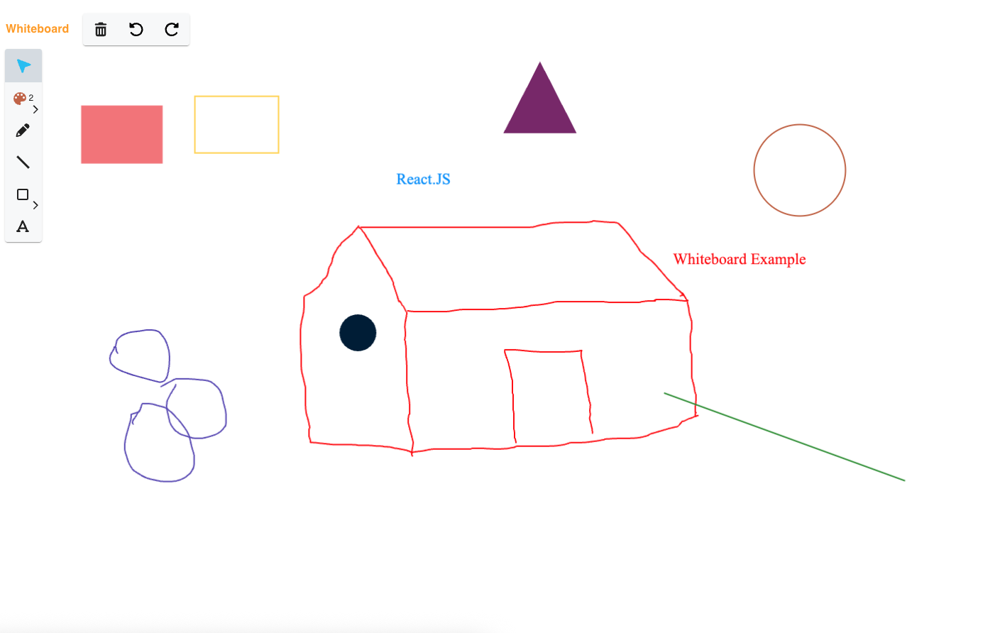

# 🖊️ Whiteboard Application

An interactive whiteboard built using **React, Redux Toolkit, and Fabric.js (v7)**.

This application allows users to draw shapes, freehand sketch, add text, customize colors, and manage undo/redo operations in real time.

---

## 🚀 Features

- ✏️ Freehand drawing (Pen tool)
- ⬛ Draw Shapes:
  - Rectangle
  - Square
  - Circle
  - Triangle
  - Filled versions
- 📏 Draw straight lines
- 🔤 Add editable text
- 🎨 Color picker
- 📐 Adjustable brush thickness
- 🖱️ Select & manipulate objects
- 🗑️ Delete selected object
- ↩️ Undo / Redo functionality
- 🟢 Custom object control styling

---

## 🛠️ Tech Stack

- **React 19**
- **Redux Toolkit**
- **Fabric.js v7**
- **Material UI (MUI)**

---

## ⚙️ Installation

```bash
npm install

npm start
```

---

## 📸 Output



---
